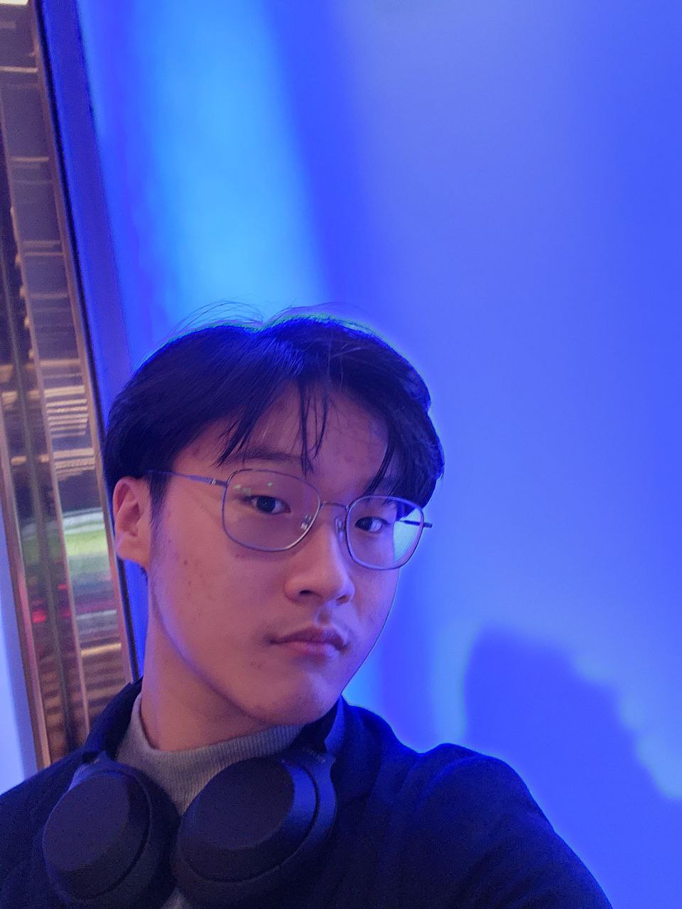
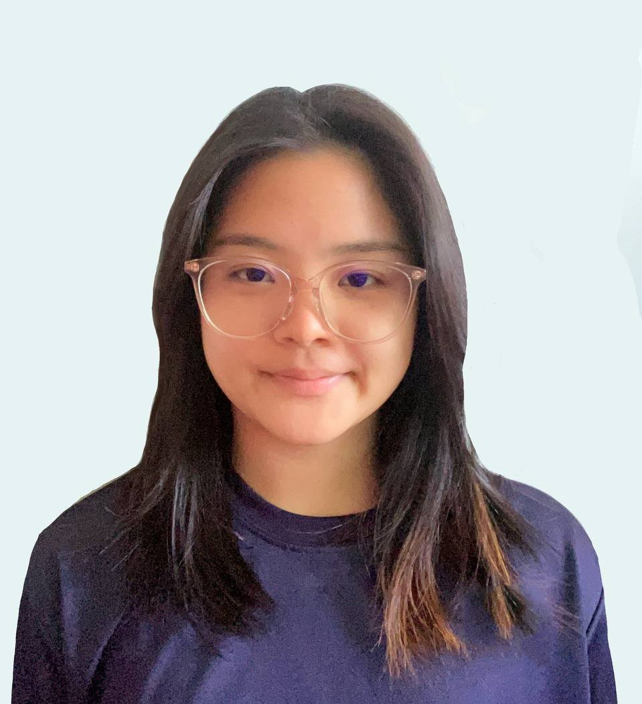
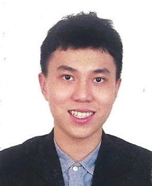
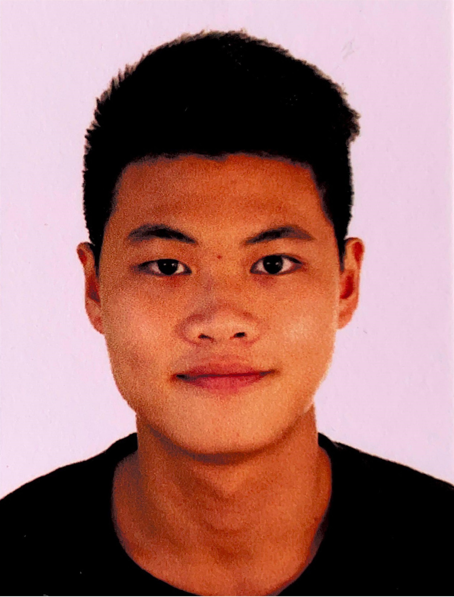
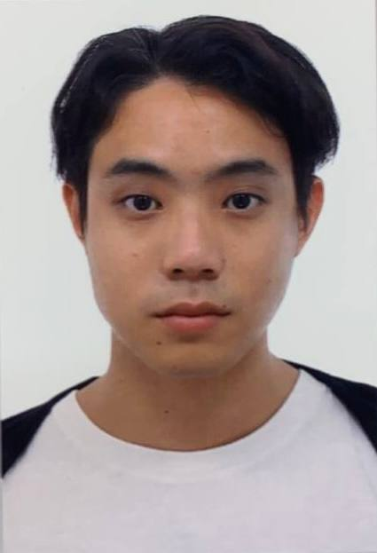

# About Us

We are a team based in the [School of Computing, National University of Singapore](http://www.comp.nus.edu.sg).

You can reach us at the email `seer[at]comp.nus.edu.sg`

## Project team

### Bryan Goh

[[homepage](https://github.com/AY2324S1-CS2103T-W09-3/tp.git)]
[[github](https://github.com/Bryan-Goh)]
[[portfolio](team/johndoe.md)]

* Role: Developer
* Responsibilities: Delete Appointments

### Foo Jing Ning

[[github](http://github.com/yezkez10)]
[[portfolio](team/johndoe.md)]

* Role: Team Lead
* Responsibilities: Add Patients

### Niu Wenjia

[[github](http://github.com/wj331)] 
[[portfolio](team/johndoe.md)]

* Role: Developer
* Responsibilities: Delete Patients

### Toh Pin Ren

[[github](http://github.com/tohpinren)]
[[portfolio](team/johndoe.md)]

* Role: Developer
* Responsibilities: Add Lists

### Yip Sin Hang

[[github](http://github.com/simbayippy)]
[[portfolio](team/johndoe.md)]

* Role: Developer
* Responsibilities: Add Appointments
