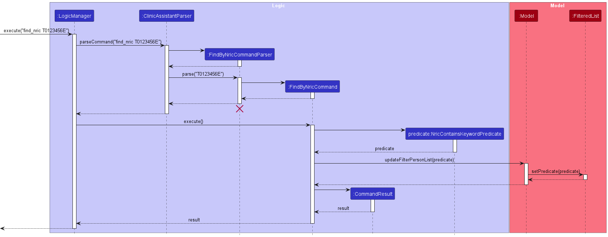

# ClinicAssistant Developer Guide

<!-- * Table of Contents -->
<page-nav-print />

--------------------------------------------------------------------------------------------------------------------

## **Acknowledgements**

Base code adapted from [AY23/24 CS2103T Github](https://github.com/nus-cs2103-AY2324S1/tp)

--------------------------------------------------------------------------------------------------------------------

## **Setting up, getting started**

Refer to the guide [_Setting up and getting started_](SettingUp.md).

--------------------------------------------------------------------------------------------------------------------

## **Design**

### Architecture

<puml src="diagrams/ArchitectureDiagram.puml" width="280" />

The ***Architecture Diagram*** given above explains the high-level design of the App.

Given below is a quick overview of main components and how they interact with each other.

**Main components of the architecture**

**`Main`** (consisting of classes [`Main`](https://github.com/se-edu/addressbook-level3/tree/master/src/main/java/seedu/address/Main.java) and [`MainApp`](https://github.com/se-edu/addressbook-level3/tree/master/src/main/java/seedu/address/MainApp.java)) is in charge of the app launch and shut down.
* At app launch, it initializes the other components in the correct sequence, and connects them up with each other.
* At shut down, it shuts down the other components and invokes cleanup methods where necessary.

The bulk of the app's work is done by the following four components:

* [**`UI`**](#ui-component): The UI of the App.
* [**`Logic`**](#logic-component): The command executor.
* [**`Model`**](#model-component): Holds the data of the App in memory.
* [**`Storage`**](#storage-component): Reads data from, and writes data to, the hard disk.

[**`Commons`**](#common-classes) represents a collection of classes used by multiple other components.

**How the architecture components interact with each other**

The *Sequence Diagram* below shows how the components interact with each other for the scenario where the user issues the command `delete 1`.

<puml src="diagrams/ArchitectureSequenceDiagram.puml" width="574" />

Each of the four main components (also shown in the diagram above),

* defines its *API* in an `interface` with the same name as the Component.
* implements its functionality using a concrete `{Component Name}Manager` class (which follows the corresponding API `interface` mentioned in the previous point.

For example, the `Logic` component defines its API in the `Logic.java` interface and implements its functionality using the `LogicManager.java` class which follows the `Logic` interface. Other components interact with a given component through its interface rather than the concrete class (reason: to prevent outside component's being coupled to the implementation of a component), as illustrated in the (partial) class diagram below.

<puml src="diagrams/ComponentManagers.puml" width="300" />

The sections below give more details of each component.

### UI component

The **API** of this component is specified in [`Ui.java`](https://github.com/se-edu/addressbook-level3/tree/master/src/main/java/seedu/address/ui/Ui.java)

<puml src="diagrams/UiClassDiagram.puml" alt="Structure of the UI Component"/>

The UI consists of a `MainWindow` that is made up of parts e.g.`CommandBox`, `ResultDisplay`, `PersonListPanel`, `StatusBarFooter` etc. All these, including the `MainWindow`, inherit from the abstract `UiPart` class which captures the commonalities between classes that represent parts of the visible GUI.

The `UI` component uses the JavaFx UI framework. The layout of these UI parts are defined in matching `.fxml` files that are in the `src/main/resources/view` folder. For example, the layout of the [`MainWindow`](https://github.com/se-edu/addressbook-level3/tree/master/src/main/java/seedu/address/ui/MainWindow.java) is specified in [`MainWindow.fxml`](https://github.com/se-edu/addressbook-level3/tree/master/src/main/resources/view/MainWindow.fxml)

The `UI` component,

* executes user commands using the `Logic` component.
* listens for changes to `Model` data so that the UI can be updated with the modified data.
* keeps a reference to the `Logic` component, because the `UI` relies on the `Logic` to execute commands.
* depends on some classes in the `Model` component, as it displays `Person` object residing in the `Model`.

### Logic component

**API** : [`Logic.java`](https://github.com/se-edu/addressbook-level3/tree/master/src/main/java/seedu/address/logic/Logic.java)

Here's a (partial) class diagram of the `Logic` component:

<puml src="diagrams/LogicClassDiagram.puml" width="550"/>

The sequence diagram below illustrates the interactions within the `Logic` component, taking `execute("delete 1")` API call as an example.

<puml src="diagrams/DeleteSequenceDiagram.puml" alt="Interactions Inside the Logic Component for the `delete 1` Command" />

<box type="info" seamless>

**Note:** The lifeline for `DeleteCommandParser` should end at the destroy marker (X) but due to a limitation of PlantUML, the lifeline reaches the end of diagram.
</box>

How the `Logic` component works:

1. When `Logic` is called upon to execute a command, it is passed to an `AddressBookParser` object which in turn creates a parser that matches the command (e.g., `DeleteCommandParser`) and uses it to parse the command.
1. This results in a `Command` object (more precisely, an object of one of its subclasses e.g., `DeleteCommand`) which is executed by the `LogicManager`.
1. The command can communicate with the `Model` when it is executed (e.g. to delete a person).
1. The result of the command execution is encapsulated as a `CommandResult` object which is returned back from `Logic`.

Here are the other classes in `Logic` (omitted from the class diagram above) that are used for parsing a user command:

<puml src="diagrams/ParserClasses.puml" width="600"/>

How the parsing works:
* When called upon to parse a user command, the `AddressBookParser` class creates an `XYZCommandParser` (`XYZ` is a placeholder for the specific command name e.g., `AddCommandParser`) which uses the other classes shown above to parse the user command and create a `XYZCommand` object (e.g., `AddCommand`) which the `AddressBookParser` returns back as a `Command` object.
* All `XYZCommandParser` classes (e.g., `AddCommandParser`, `DeleteCommandParser`, ...) inherit from the `Parser` interface so that they can be treated similarly where possible e.g, during testing.

### Model component
**API** : [`Model.java`](https://github.com/se-edu/addressbook-level3/tree/master/src/main/java/seedu/address/model/Model.java)

<puml src="diagrams/ModelClassDiagram.puml" width="450" />

The `Model` component,

* stores the address book data i.e., all `Person` objects (which are contained in a `UniquePersonList` object).
* stores the currently 'selected' `Person` objects (e.g., results of a search query) as a separate _filtered_ list which is exposed to outsiders as an unmodifiable `ObservableList<Person>` that can be 'observed' e.g. the UI can be bound to this list so that the UI automatically updates when the data in the list change.
* stores a `UserPref` object that represents the user’s preferences. This is exposed to the outside as a `ReadOnlyUserPref` objects.
* does not depend on any of the other three components (as the `Model` represents data entities of the domain, they should make sense on their own without depending on other components)

<box type="info" seamless>

**Note:** An alternative (arguably, a more OOP) model is given below. It has a `Tag` list in the `AddressBook`, which `Person` references. This allows `AddressBook` to only require one `Tag` object per unique tag, instead of each `Person` needing their own `Tag` objects. 

<puml src="diagrams/BetterModelClassDiagram.puml" width="450" />

</box>

### Storage component

**API** : [`Storage.java`](https://github.com/se-edu/addressbook-level3/tree/master/src/main/java/seedu/address/storage/Storage.java)

<puml src="diagrams/StorageClassDiagram.puml" width="550" />

The `Storage` component,
* can save both address book data and user preference data in JSON format, and read them back into corresponding objects.
* inherits from both `AddressBookStorage` and `UserPrefStorage`, which means it can be treated as either one (if only the functionality of only one is needed).
* depends on some classes in the `Model` component (because the `Storage` component's job is to save/retrieve objects that belong to the `Model`)

### Common classes

Classes used by multiple components are in the `seedu.addressbook.commons` package.

--------------------------------------------------------------------------------------------------------------------

## **Implementation**

This section describes some noteworthy details on how certain features are implemented.

### Add patient feature

#### Implementation

This feature deals with adding a patient to the health records database.

The fields required when adding a patient are the patient's
* `Name`
* `Age`
* `Gender`
* `Ethnicity`
* `Nric`
* `Phone`
* `Email`
* `Address`

This feature is facilitated by the `Person` class and the `UniquePersonList`, which extends Iterable<Person>
and ensures all the Persons in this list is unique.
The `Person` class stores the required fields of the patient.

**The Specifics**

`AddCommandParser` parses the user-inputted command and creates a `Person` object
with its required fields, as well as an `AddCommand` that adds this person into the `Model`.
This `Person` is added into the `UniquePersonList`.

### Add/delete Doctor feature

#### Implementation

 The proposed add/delete Doctor mechanism is facilitated by `UniqueDoctorList` and a `Doctor` Class. `UniqueDoctorList` extends `Iterable<Doctor>` which stores and ensures all the Doctors in this list is unique. Additionally it implements the same operations as the `UniquePersonList`.
 The Doctor class stores the relevant data of the Doctor such as name and gender.
 The following sequence diagram shows how the add Doctor operation works.

<puml src="diagrams/AddDoctor.puml" alt="AddDoctor" />

The delete Doctor command does the opposite — it calls deleteDoctor(INDEX), which deletes the Doctor from the system by their Index.

**Note:** If the index of either add or delete is less than 1 or exceeds the number of Doctors in the List then the command is going to fail.

#### Design considerations:

**Aspect: How Doctor is going to be saved:**

* **Alternative 1 (current choice):** Doctor is its own class containing detailed information on the doctor.
    * Pros: Similar to Person
    * Cons: May introduce new bugs and is generally going to take up a lot of lines of code.

* **Alternative 2:** Doctor is just a String and is going to be saved inside an ArrayList since the most important part is just the name.
    * Pros: Will be easier to implement and much simpler.
    * Cons: Going to be harder for future developer to update the Doctor Class.

### \[Proposed\] Delete Patient

#### \[Proposed\] Implementation

The proposed delete mechanism is facilitated by `DeleteCommand` and the `LogicManager` Class.
User can enter `delete 3` which deletes all information, including appointments and details, of the person in the list.
The following sequence diagram shows how the DeleteCommand class works.

<diag src="diagrams/DeleteCommandDiagram" alt="DeleteCommand UML" />

**Note:** If the index of patient to be deleted is less than 1 or exceeds the number of patients in the List then deleteCommand is going to fail.

#### Design considerations:

**Aspect: How convenient it is for clinic staff to delete:**

* **Alternative 1 (current choice):** Delete based on INDEX shown on the present list
    * Pros: Intuitive and easy for nurse to delete
    * Cons: Needs to use zero-based indexing since lists are zero-indexed but the view of clinic staff is one-indexed.

* **Alternative 2:** Delete based on name of patient
    * Pros: Will be more accurate when deleting a patient
    * Cons: Takes more time as need to type out names of patient when deleting and length of names may vary from person to person

### List feature

#### Implementation

The list appointments feature is added on from the `Appointment` class. The `list_appt` command will list out all
appointments in the Clinic Assistant database.

Firstly, to implement the list appointments command, we have to edit the current frontend to add a new Panel to display
the appointments. This is done by adding a new `AppointmentListPanel` class to the `seedu.address.ui` package. This
class is then added to the `MainWindow` class to display the appointments. The `AppointmentCard` class is also added to
display the individual appointments inside the `AppointmentListPanel`. In addition, the corresponding `fxml` files are
also added to the `view` folder to display the appointments.

To implement the backend of the list appointments command, we first have to store the appointments in the database.
Like the implementation of storing of `Person`, we keep a `UniqueAppointmentList` in the `Model` class to store the
appointments. The `UniqueAppointmentList` class is similar to the `UniquePersonList` class, except that it stores
`Appointment` objects instead of `Person` objects. What we show on the frontend is the filtered list of appointments
from the `UniqueAppointmentList` class.

A `ListAppointmentCommand` class is then created to handle the `list_appt` command. This class is similar to the
`ListCommand` class, except that it handles the `Appointment` objects instead of `Person` objects. The
`ListAppointmentCommand` class will then be called by the `LogicManager` class to execute the `list_appt` command.
What this command does is that it changes the predicate to the filtered list of appointments to show all the
appointments in the database.

#### Alternatives considered

**Aspect: How to store and maintain list of appointments:**

* **Alternative 1 (current choice):** Save the list of appointments as a `UniqueAppointmentList` and filter it when needed.
    * Pros: Easy to implement - similar to the current implementation of `Person`
    * Cons: More memory is used to store the list of appointments

* **Alternative 2:** Get the list of appointments by parsing through each `Person` object in the `UniquePersonList`
    * Pros: Will use less memory
    * Cons: Will be slower because we have to iterate through all the `Person` objects to get the appointments each time

### Find appointments by date feature

#### Implementation

The find appointments by date feature built on the find appointment command. The `find_appt /on` command will list out
all appointments in the Clinic Assistant database that falls on the date given.

To implement the find appointments by date command, we have to update the predicate for the filtered list of
appointments to show on the frontend. We have to add a predicate to check for all the appointments that falls on the
date given.

The find appointment command is extended to take in different parameters and filter the list shown on the frontend
accordingly.

#### Alternatives considered

**Aspect: How to implement the find appointments by date command:**

* **Alternative 1 (current choice):** Extend the functionality of the find appointment command to take in different parameters
    * Pros: More user-friendly and allows user to filter by multiple parameters
    * Cons: Harder to implement

* **Alternative 2:** Add a new command to only filter by date
    * Pros: Easier to implement
    * Cons: Users cannot filter by multiple parameters

### Find patient by NRIC feature

#### Implementation

The find patient by NRIC feature will find a patient whose NRIC matches the given NRIC.
This feature is facilitated by the `FindByNricCommandParser` and `FindByNricCommand` classes.
To find a patient using a given NRIC, we have to use this NRIC as a predicate for the list of patients with unique NRICs.
We will compare each patient's NRIC to this given NRIC and return the patient with the matching NRIC.

**The Specifics**

The job of the `FindByNricCommandParser` is to create a `FindByNricCommand` command object,
with a `NricContainsKeywordPredicate` object passed in as a parameter.

The `updateFilteredPersonList` method in the `Model` class is called,
which then calls the `setPredicate` method in the `FilteredList` class,
both with the `NricContainsKeywordPredicate` object passed in as the predicate.

The above shows the sequence diagram of the find by NRIC feature.

**Alternatives considered**

**Aspect: How to implement find patient by NRIC feature**

* **Alternative 1 (current choice):** Create a new command that takes in the required NRIC as an argument.
    * Pros: Easy to implement, as it has a structure similar to the original Find command.
    * Cons: If users were to input an erratic NRIC, no matching patients will be shown.
* **Alternative 2:** Extend the pre-existing Find command to accept NRIC as another argument
    * Pros: With more parameters, users can look for more patients at one time.
  Even if the user inputs an erratic NRIC, they can still input the patients name
  and receive a list of possible matching patients to choose from.
    * Cons: This is harder to implement as the FilteredList would have to take in more than 1 type of predicate.

### Add/delete Appointment feature

#### Implementation

The add/delete Appointment mechanism is facilitated by `UniqueAppointmentList` and a `Appointment` Class. `UniqueAppointmentList` extends `Iterable<Appointment>` which stores and ensures all the Appointments in this list are unique. Additionally it implements the same operations as the `UniquePersonList`.
The Appointment class stores the relevant data of the Appointment such as description, date (inclusive of time) as well as Patient it belongs to.

The delete Appointment command does the opposite — it calls deleteAppointment(INDEX), which deletes the Appointment from the system by their Index.

**Note:** If the index of either add or delete is less than 1 or exceeds the number of Appointments in the List then the command will fail.

#### Design considerations:

**Aspect: How Appointments are going to be saved:**

* **Alternative 1 (current choice):** Appointment is its own class containing detailed information on the Appointment.
    * Pros: Similar to Person
    * Cons: May introduce new bugs and is generally going to take up a lot of lines of code.

* **Alternative 2:** Appointments are just a String and is going to be saved inside an ArrayList.
    * Pros: Will be easier to implement and much simpler.
    * Cons: Going to be harder for future developers to update the Appointment Class.

### Edit Appointment feature

#### Implementation

The edit Appointment mechanism is facilitated by the `EditAppointmentDescriptor` class. It's mechanism is similar to that of `EditCommand`'s implementation.
An `edit_appt` command input takes in an Appointment Index, followed by a minimum of 1 required input change of either description `[/d]` or date `[/on]`.

After receiving the users input, the `EditAppointmentCommandParser` parses the given input to form an `EditAppointmentDescriptor`, which will then be used by `createEditedAppointment` to create an Appointment to replace the user specified index.

**Note:** If the Index provided is invalid (0 or bigger than the size of Appointment list), or no input change is given, the command will fail.

#### Design considerations:

**Aspect: How Appointments are going to be edited:**

* **Alternative 1 (current choice):** Appointment is Edited based on its Index in the overall Appointment List
    * Pros: One centralized Appointment List for all Edit Appointment operations
    * Cons: Harder to implement

* **Alternative 2:** An additional Index field of the Patients Index is to be given, followed by his/her Appointment to edit
    * Pros: Appointment to be edited is specified to the specific Patient index input
    * Cons: Harder for the user to visualise which Appointment he is going to edit

### View Available Timeslots feature

#### Implementation

The view available timeslots mechanism is facilitated by the `UniqueTimeslotList` class.
A `view` command input takes in a date and displays all available timeslots for that date. This is mainly used by users
to identify available timeslots in an instant which they can use to book appointments on.

After receiving the users input, the `ViewAvailableCommandParser` parses the given input to return a `ViewAvailableCommand` instance which will then be executed.

**Note:** If the date provided is invalid (non-existent date (eg 31-02-2024), or any date that has past)), the command will fail.

#### Design considerations:

**Aspect: What Timeslots will be added:**

* **Alternative 1 (current choice):** Loop through all appointments in the appointment list and only add timeslots which are available
    * Pros: Allows to retrieve the latest appointments and add available timeslots accurately
    * Cons: Increased coupling between timeslots and appointment

* **Alternative 2:** Add the time from appointments directly without any timeslot
    * Pros: Easier to implement as we only need to get time from appointment directly
    * Cons: Harder for user to visualise exactly which timeslot is available and can be used to book appointments

## **Planned enhancements**

### Edit Doctor

#### Implementation

This enhancement will let the user edit details of the doctor inside the clinic assistant without deleting or interfering with the appointments that doctor has.

This edit command will take in a parameter INDEX which is a positive integer which references to the index of doctors shown on the screen.

Furthermore it will take in information that the specified doctor's information will be changed to.
This will create a new Doctor Object and transfer over all the information that isnt specified in the edit command to be the same as the original doctor.

#### Design consideration:

**Aspect: How the doctor object is going to be edited:**

* You can make it so that you change the value of the variables inside the original doctor
    * Pros: save space and improve space and time complexity
    * Cons: Risk introducing unexpected bug as Doctor is no longer immutable

### Edit Appointment to include editing of Doctor details

#### Implementation

This enhancement will let the user edit the appointments associated doctor.

This edit command will take in a parameter INDEX which is a positive integer which references to the index of doctors shown on the screen.

Furthermore it will take in information that the specified doctor's information will be changed to.
This will then change the doctor associated with the appointment the user is editing.

#### Design consideration:

**Aspect: How the doctor is going to be edited:**

* Edit associated doctor based on INDEX shown on the present doctor list. e.g., `edit_appt /doc 2` will edit the doctor associated to the appointment to the second doctor displayed in the Doctor list.
    * Pros: Intuitive for clinic assistants to use
    * Cons: Might be difficult to implement

## **Documentation, logging, testing, configuration, dev-ops**

* [Documentation guide](Documentation.md)
* [Testing guide](Testing.md)
* [Logging guide](Logging.md)
* [Configuration guide](Configuration.md)
* [DevOps guide](DevOps.md)

--------------------------------------------------------------------------------------------------------------------

## **Appendix: Requirements**

### Product scope

**Target user profile: Clinic Staff**

* has a need to manage a significant number of patients
* prefer desktop apps over other types
* can type fast
* prefers typing to mouse interactions

**Value proposition**: manage contacts faster than traditional pen-and-paper record taking

### User stories

Priorities: High (must have) - `* * *`, Medium (nice to have) - `* *`, Low (unlikely to have) - `*`

| Priority | As a …​                              | I want to …​                              | So that I can…​                                        |
|----------|--------------------------------------|-------------------------------------------|--------------------------------------------------------|
| `* * *`  | clinic assistant                     | register new patients to the database     | reduce the use of physical documents and storage costs |
| `* * *`  | clinic admin staff                   | delete patient records                    | keep our records up-to-date                            |
| `* * *`  | clinic assistant                     | add new appointments to specific patients | keep track of their appointments                       |
| `* * *`  | clinic admin staff                   | delete appointments of patients           | update cancellations of no-shows                       |
| `* * *`  | overwhelmed healthcare professional  | view all the patient records              | not memorise all the patients of the clinic            |
| `* * *`  | overwhelmed healthcare professional  | view a specific patient's details         | save time                                              |

*{More to be added}*

### Use cases

(For all use cases below, the **System** is the `ClinicRecords` and the **Actor** is the `Clinic staff`, unless specified otherwise)

**Use case 1: Add a patient**

**MSS**

1.  New patient visits the clinic
2.  Patient is not in ClinicRecords
3.  Clinic staff adds this new patient into the ClinicRecords
4.  ClinicRecords shows a confirmation message

    Use case ends.

**Extensions**

* 3a. The given input is invalid.

    * 3a1. ClinicRecords shows an error message.

      Use case resumes at step 3.

**Use case 2: List all patients**

**MSS**

1.  Clinic staff wants to see all patient records
2.  Clinic staff requests to list patients
3.  ClinicRecords shows a list of patients

    Use case ends.

**Use case 3: List a specific patient**

**MSS**

1. Patient visits the clinic
2. Clinic staff needs the information of this specific patient
3. Clinic staff inserts the patient's details
4. ClinicRecords retrieves the patient's information for the clinic staff

   Use case ends.

**Extensions**

* 3a. The patient cannot be found
    * 3a1. ClinicRecords shows an error message.
      Use Case resumes at step 3

**Use case 4: Delete a patient**

**MSS**

1.  	User requests to list all patients.
2.  	ClinicAssistant returns a list of all patients from the database.
3.  	User requests to delete a specific person in the list with his index.
4.  	ClinicAssistant deletes the person from the database.

      Use case ends.

**Extensions**
* 3a. The input index is invalid.
    * 3a1. ClinicAssistant shows an error message.
    * 3a2. User enters new index.
      Steps 3a1-3a2 repeated until the index entered is correct.
      Use case resumes at step 4.

**Use case 5: Viewing available timeslots**

**MSS**

1.  	User needs to book an appointment for a patient.
2.  	User chooses a date and enters it.
3.  	ClinicAssistant returns a list of available timeslots on that date.
4.  	User finds an available timeslot from the given list.
5.      User proceeds proceed to book an appointment for the patient on that specific date and timeslot

   Use case ends.

**Extensions**
* 2b. Date entered is invalid
    * 2b1. ClinicAssistant shows an error message and requests for correct date.
    * 2b2. User enters a new date.
      Steps 2b1 - 2b2 are repeated until date entered is correct
      Use case resumes at step 3.

* 3a. ClinicAssistant returns an empty list of available timeslots
    * 3a1. User now has to enter a new date
      Step 3a1 is repeated until date entered has list of at least 1 available timeslot
      Use case resumes at step 4.

*{More to be added}*

### Non-Functional Requirements

1.  Should be able to find a patient's information in less than 2 seconds
2.  Should be able to hold up to 1000 patients without a noticeable sluggishness in performance for typical usage.
3.  Should be able to load all patient's information in about 3 seconds.

*{More to be added}*

### Glossary

* **ClinicRecords**: The record book we use to store information of patients
* **Private patient record**: Details that are not meant to be shared with others
* **Clinic Staff**: Any healthcare professional at the clinics including doctors/nurses/staff

--------------------------------------------------------------------------------------------------------------------

## **Appendix: Instructions for manual testing**

Given below are instructions to test the app manually.

<box type="info" seamless>

**Note:** These instructions only provide a starting point for testers to work on;
testers are expected to do more *exploratory* testing.

</box>

### Launch and shutdown

1. Initial launch

    1. Download the jar file and copy into an empty folder

    1. Double-click the jar file Expected: Shows the GUI with a set of sample contacts. The window size may not be optimum.

1. Saving window preferences

    1. Resize the window to an optimum size. Move the window to a different location. Close the window.

    1. Re-launch the app by double-clicking the jar file. 
       Expected: The most recent window size and location is retained.

1. _{ more test cases …​ }_

### Deleting a person

1. Deleting a person while all persons are being shown

    1. Prerequisites: List all persons using the `list` command. Multiple persons in the list.

    1. Test case: `delete 1` 
       Expected: First Patient is deleted from the list. Details of the deleted contact shown in the status message. Timestamp in the status bar is updated.

    1. Test case: `delete 0` 
       Expected: No person is deleted. Error details shown in the status message. Status bar remains the same.

    1. Other incorrect delete commands to try: `delete`, `delete x`, `...` (where x is larger than the list size) 
       Expected: Similar to previous.

1. _{ more test cases …​ }_

### Saving data

1. Dealing with missing/corrupted data files

    1. _{explain how to simulate a missing/corrupted file, and the expected behavior}_

1. _{ more test cases …​ }_
